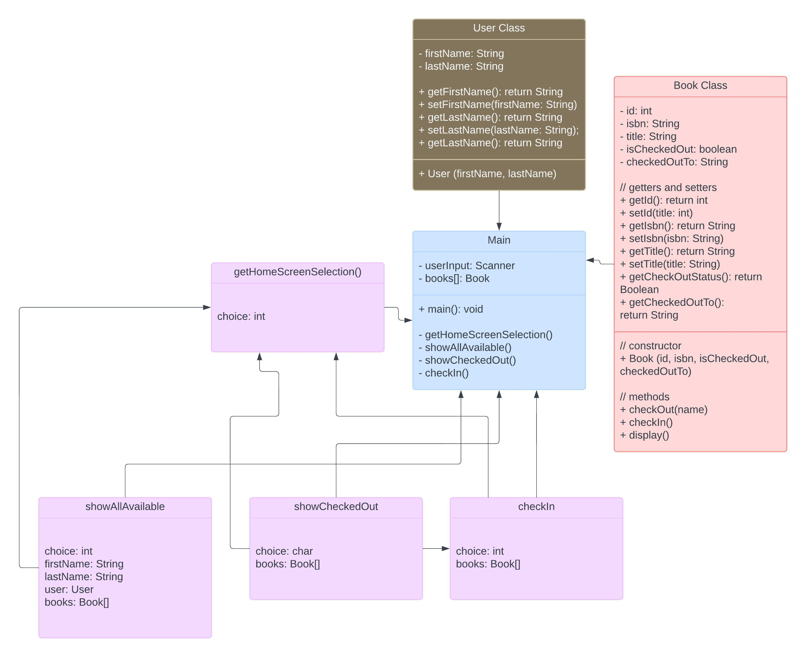

# neighborhood-library
## Book Class
This class stores all information pertaining to Book.
1. Book ID
2. ISBN
3. isCheckedOut
4. checkedOutTo

I created an extra method within Book Class that displays the current book information: 
1. Book ID
2. ISBN

## User Class
I created a brand-new User Class that was not specified in the directions. I did this in case I wanted to expand the project with more emphasis on the current user.
Currently, the User Class only stores firstName and lastName, and has a fullName Method, but may expand further with email address and phone number once needed.

## Main Class
Created a main class with 4 different screens:
### 1. getHomeScreenSelection()
- This screen takes in a User Input to 
### 2. showAvailable()
- This screen takes a for loop to go through all the books that are *CHECKED IN*. 
- Utilizes the Book.display() method within the for loop.
- Takes in User Input to choose whether to check an available book out, or move back to home screen.
### 3. showCheckedOut()
- This screen takes a for loop to go through all the books that are *CHECKED OUT*.
- Utilizes the Book.display() method within the for loop.
- Takes in User Input to choose whether to move to the Check-In Screen or go back to the Home Screen
### 4. checkIn()
- This screen utilizes the Book.checkIn() method to check in any of the checked out books from the previous screen.

## UML Diagram of Project
